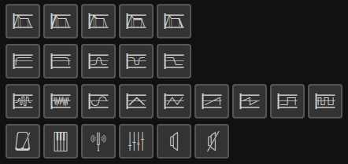

# Synth Maxima

## Description

**Synth Maxima** is a free icon font for all things sound. It might be useful
if you are making your own
[synthesizer module](https://en.wikipedia.org/wiki/Modular_synthesizer#Types_of_modules),
[DAW](https://en.wikipedia.org/wiki/Digital_audio_workstation) or whatever.

Synth Maxima is made using [Inkscape](https://inkscape.org/) vector editor
and [FontForge](https://fontforge.org/en-US/) font editor.

Current font version is pre-alpha, [issues are welcome](https://github.com/6r1d/Synth-Maxima/issues).

## Available icons

* [Oscillators](https://en.wikipedia.org/wiki/Electronic_oscillator): arbitrary, white noise, square (short and long), triangle (short and long), saw (short and long), sine
* [ADSR](https://en.wikipedia.org/wiki/Envelope_(music)): generic, attack, delay, sustain, release icons
* [Filters](https://en.wikipedia.org/wiki/High-pass_filter): high pass, low pass, band pass, band stop, loop
* Other: metronome, piano keys, tuning fork, equalizer, loudspeaker, muted loudspeaker

## Usage

Just install `Synth_Maxima.ttf` font into your system and pick icons you like.
There's also a WOFF version of a font.

## Sources

There are three directories with SVG files: `sheet`, `src_units` and `units`.
Sheet simply contains a full sheet with all icons.
One called `src_units` contains SVG files, resized from an initial `sheet`,
called `icons_fixed.svg`.
One called `units` contains vector shapes for FontForge import.

## License

* SVG icons: [CC BY 4.0 License](https://creativecommons.org/licenses/by/4.0/)
* Font: [SIL OFL 1.1 License](https://scripts.sil.org/cms/scripts/page.php?site_id=nrsi&id=OFL)
