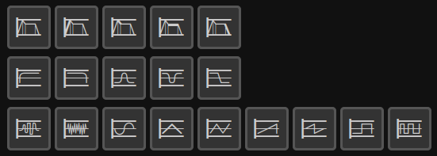

# Synth Maxima

## Описание

**Synth Maxima** — бесплатный и открытый шрифт с иконками по теме обработки звука.
Он может оказаться полезен, если вы делаете [свой модуль](https://en.wikipedia.org/wiki/Modular_synthesizer#Types_of_modules) для модульного синтезатора, [цифровую звуковую рабочую станцию](https://en.wikipedia.org/wiki/Digital_audio_workstation), или где-то ещё. Также он может оказаться бесполезным.

Шрифт Synth Maxima сделан с использованием векторного редактора [Inkscape](https://inkscape.org/)
и шрифтового редактора [FontForge](https://fontforge.org/en-US/).

Нынешняя версия шрифта — очень сырая, с идеями и советами [добро пожаловать в секцию issues](https://github.com/6r1d/Synth-Maxima/issues).

## Доступные иконки

* [Осцилляторы](https://en.wikipedia.org/wiki/Electronic_oscillator): произвольный, белый шум, прямоугольная волна (2), треугольная волна (2), пилообразная волна (2), синусоида.
* [Огибающая](https://en.wikipedia.org/wiki/Envelope_(music)): общая иконка, атака, задержка, удержание, затухание.
* [Фильтры](https://en.wikipedia.org/wiki/High-pass_filter): ФНЧ, ФВЧ, полосовой,　заграждающий, контурный.
* Другое: метроном, клавиши пианино, камертон, эквалайзер, динамик, выключенный динамик

## Применение

Просто загрузите репозиторий и установите шрифт `Synth_Maxima_Medium.ttf` в вашей системе.
Теперь вы можете выбрать иконки. Ещё существует woff-версия шрифта для веб-страниц.

## Исходники

Есть три директории проекта: `sheet`, `src_units` and `units`.
В `sheet` лежит лист со всеми иконками.
В `src_units` лежат отдельные иконки, подогнанные по размеру и цвету.
Наконец, `units` содержит отдельные векторные формы, подготовленные для импорта в FontForge.

## Лицензия

* Иконки: [CC BY 4.0 License](https://creativecommons.org/licenses/by/4.0/)
* Шрифт: [SIL OFL 1.1 License](https://scripts.sil.org/cms/scripts/page.php?site_id=nrsi&id=OFL)
